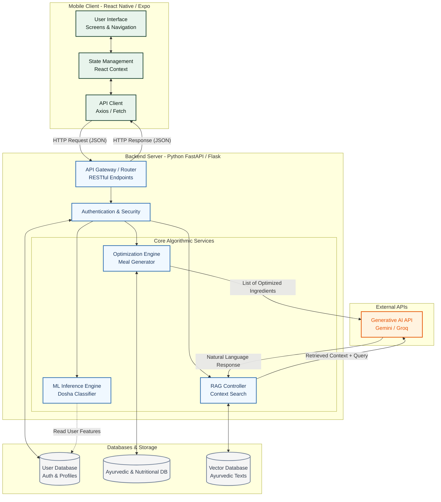
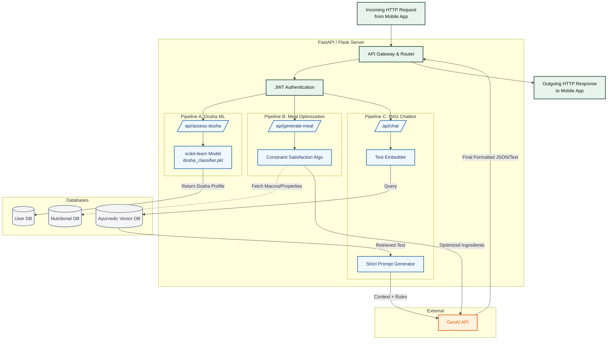

# AyurNutri: Hybrid AI Architecture & Technical Approach

## 1. Problem Statement & Motivation
In its initial iteration, AyurNutri relied entirely on Generative AI (LLMs like Gemini and Groq) to perform core logic, such as determining a user's Ayurvedic Dosha and generating meal plans. While functional, this approach lacks the academic rigor required for a Major Project or an IEEE research paper because:
1. **Lack of Original Algorithmic Contribution:** The system acts as an API wrapper rather than an independent computational engine.
2. **Hallucination Risk:** LLMs cannot guarantee 100% medically or nutritionally accurate Ayurvedic recommendations.
3. **Lack of Patentable Novelty:** Prompt engineering an existing LLM is not considered a patentable technical invention.

## 2. The Solution: A Hybrid AI System
To resolve these issues, the architecture is redesigned into a **Hybrid AI System**. In this approach, Generative AI is relegated strictly to the **Presentation Layer** (Natural Language Generation), while the **Core Logic Layer** is driven by custom-built Machine Learning models and mathematical constraint algorithms.

This guarantees deterministic accuracy, establishes a clear computer science contribution, and introduces patentable methodology.

---

## 3. Core Technical Contributions (The "Correct Approach")

### A. Machine Learning Dosha Classifier
Instead of prompting an LLM to guess a user's Dosha, the system utilizes a traditional Machine Learning classification model (e.g., Random Forest or Support Vector Machine).
*   **The Flow:** 
    1. The React Native app collects user physiological and psychological traits via a questionnaire.
    2. The Python backend preprocesses this data (encoding categorical variables).
    3. The trained ML model processes the feature set and outputs a deterministic probability array (e.g., 60% Vata, 30% Pitta, 10% Kapha).
*   **Academic Value:** The model can be evaluated using standard metrics (Accuracy, Precision, Recall, F1-Score) against a collected dataset, forming the basis of the IEEE paper's results section.

### B. Ayurvedic-Nutritional Constraint Optimization Engine
This is the central algorithmic innovation and the primary candidate for patenting. It replaces the LLM's "guessing" of meal plans with a strict mathematical optimization algorithm.
*   **The Flow:**
    1. The backend receives the user's ML-predicted Dosha and modern macronutrient goals (e.g., 2000 Calories, 100g Protein).
    2. The algorithm queries a structured JSON/SQL database where every food item is tagged with both Nutritional data (macros) and Ayurvedic properties (Rasa, Virya, Vipaka).
    3. The algorithm applies a **Constraint Satisfaction approach**: It strictly filters out foods that aggravate the user's Dosha (e.g., rejecting "Heating" foods for a Pitta user).
    4. It then runs a combinatorial calculation to select a mix of the remaining approved foods that perfectly hit the macronutrient targets.
*   **Patent Value:** The specific mathematical formula used to calculate the "AyurNutri Compatibility Score" to rank and select these foods is a novel, patentable computational method.

### C. Retrieval-Augmented Generation (RAG)
To provide a conversational chatbot without the risk of hallucinations, the system implements a RAG architecture.
*   **The Flow:**
    1. A Vector Database (e.g., Pinecone/ChromaDB) is populated with embeddings of verified Ayurvedic texts (like the Charaka Samhita).
    2. When a user asks a question, the system searches the Vector Database for the most relevant ancient texts.
    3. Only the retrieved, verified text is passed to the LLM (Gemini) as context.
    4. The LLM formats the final response based strictly on the provided context.

---

## 4. System Architecture Flow

The system is cleanly divided into a frontend client and a heavy computational backend.

1. **Frontend (React Native / Expo):** 
   * Handles UI, state management, and collects user inputs.
   * Makes RESTful HTTP JSON requests to the backend API.
2. **Backend (Python / FastAPI) - Detailed Workflow:**
   The backend acts as the central orchestrator and computational brain of the application. It operates through three main service pipelines:
   
   *   **A. ML Inference Pipeline (Dosha Assessment):**
       *   **Input:** Receives a JSON payload from the app containing the user's questionnaire answers.
       *   **Processing:** The FastAPI server passes these answers through a pre-processing function (encoding categorical data). It then loads the pre-trained model (e.g., `dosha_classifier.pkl`) into memory and runs an inference prediction.
       *   **Output:** Returns a mathematically calculated Dosha probability distribution (e.g., `{"Vata": 0.7, "Pitta": 0.2, "Kapha": 0.1}`).
   
   *   **B. Optimization Pipeline (Meal Generation):**
       *   **Input:** Receives the user's predicted Dosha and target macronutrients (e.g., 500 kcal, 30g protein).
       *   **Processing:** The backend loads the `NutritionalDB`. It executes a Python constraint-satisfaction algorithm (similar to a Knapsack problem solver). First, it applies an *Ayurvedic Constraint* to strictly filter out foods that aggravate the user's Dosha based on Rasa/Virya properties. Second, it applies a *Nutritional Constraint* to iteratively select a combination of the remaining foods that sum exactly to the target macros.
       *   **Output:** A mathematically sound, 100% accurate list of raw ingredients. Only this final verified list is passed to the GenAI API to be formatted into a human-readable recipe.
   
   *   **C. RAG Pipeline (Ayurvedic Chatbot):**
       *   **Input:** Receives a natural language question (e.g., "What herbs help with digestion?").
       *   **Processing:** The backend converts the text into a vector embedding and queries the `VectorDB` (which contains chunked embeddings of verified texts like the Charaka Samhita). It retrieves the top most relevant paragraphs.
       *   **Output:** The backend constructs a strict, bounded prompt for the GenAI API: *"Answer the user's question using ONLY the following retrieved Ayurvedic text: [Insert Text Here]."* This guarantees the chatbot cannot hallucinate unsafe medical advice.

### Backend Internal Architecture Diagram

3. **Databases:**
   * **User DB:** Stores profiles, progress, and auth.
   * **Nutritional DB:** The structured tabular data of foods and their Ayurvedic properties.
   * **Vector DB:** Embeddings for the chatbot.
4. **External LLM (Gemini API):**
   * Placed at the very end of the pipeline. It receives the calculated arrays/lists from the Python backend and translates them into conversational English for the user interface.

---

## 5. Conclusion & Next Steps
By adopting this correct flow, **AyurNutri** transitions from a simple AI wrapper to a complex, multi-layered data science and software engineering project. 
*   **For the IEEE Paper:** We will document the accuracy of the ML Dosha Classifier and the hallucination-reduction metrics of the RAG system.
*   **For the Major Project:** The custom Python backend and Optimization Engine prove high-level algorithmic coding capability.
*   **Next Development Step:** Initialize the Python FastAPI backend and construct the tabular dataset required to train the ML Dosha Classifier.
